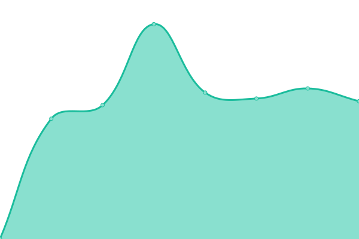
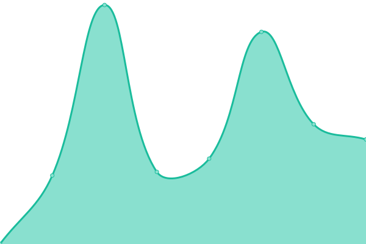
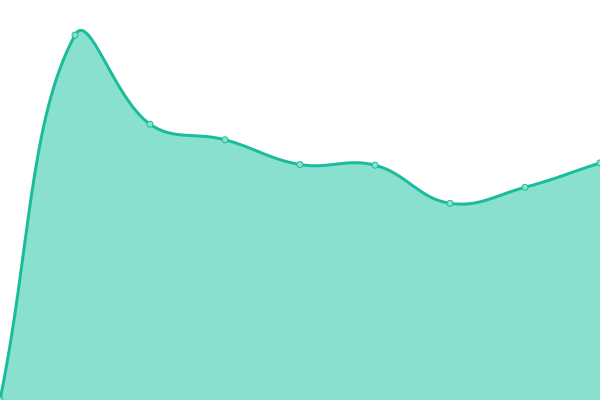
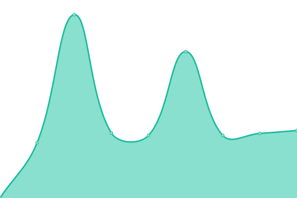
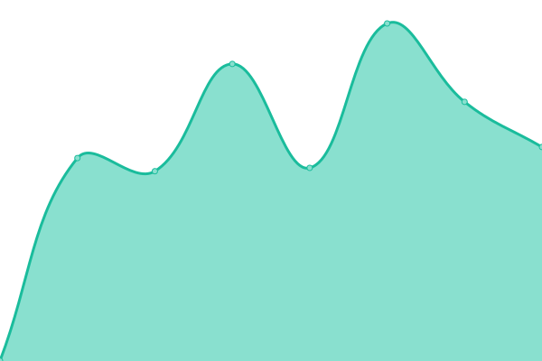
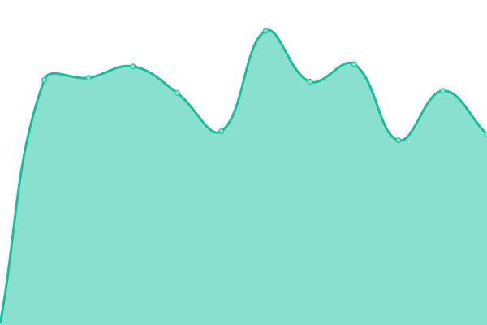
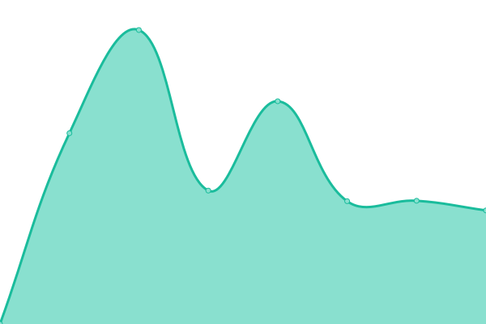
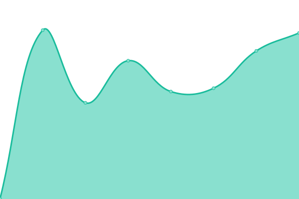
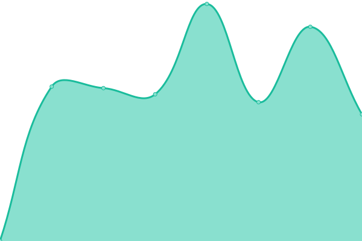

# [📈 Live Status](https://upptime.web.vlaanderen): <!--live status--> **🟩 All systems operational**

This repository contains the open-source uptime monitor and status page for [Maarten Slembrouck](https://www.web.vlaanderen), powered by [Upptime](https://github.com/upptime/upptime).

With [Upptime](https://upptime.js.org), you can get your own unlimited and free uptime monitor and status page, powered entirely by a GitHub repository. We use [Issues](https://github.com/webvlaanderen/upptime/issues) as incident reports, [Actions](https://github.com/webvlaanderen/upptime/actions) as uptime monitors, and [Pages](https://upptime.web.vlaanderen) for the status page.

<!--start: status pages-->
<!-- This summary is generated by Upptime (https://github.com/upptime/upptime) -->
<!-- Do not edit this manually, your changes will be overwritten -->
<!-- prettier-ignore -->
| URL | Status | History | Response Time | Uptime |
| --- | ------ | ------- | ------------- | ------ |
|  [WEB Vlaanderen](https://www.web.vlaanderen) | 🟩 Up | [web-vlaanderen.yml](https://github.com/WEB-Vlaanderen/upptime/commits/HEAD/history/web-vlaanderen.yml) | 

 871ms
     
 | 

<a href="https://upptime.web.vlaanderen/history/web-vlaanderen">100.00%</a>
    

|  [Coach WEB Vlaanderen](https://coach.web.vlaanderen) | 🟩 Up | [coach-web-vlaanderen.yml](https://github.com/WEB-Vlaanderen/upptime/commits/HEAD/history/coach-web-vlaanderen.yml) | 

 1017ms
     
 | 

<a href="https://upptime.web.vlaanderen/history/coach-web-vlaanderen">100.00%</a>
    

|  [Albert Vastgoed](https://www.albert-vastgoed.be) | 🟩 Up | [albert-vastgoed.yml](https://github.com/WEB-Vlaanderen/upptime/commits/HEAD/history/albert-vastgoed.yml) | 

 1158ms
     
 | 

<a href="https://upptime.web.vlaanderen/history/albert-vastgoed">100.00%</a>
    

|  [Albert Boutique](https://www.albert.boutique) | 🟩 Up | [albert-boutique.yml](https://github.com/WEB-Vlaanderen/upptime/commits/HEAD/history/albert-boutique.yml) | 

 1252ms
     
 | 

<a href="https://upptime.web.vlaanderen/history/albert-boutique">100.00%</a>
    

|  [Albert Vastgoed - Residentie Madison](https://www.residentiemadison.be) | 🟩 Up | [albert-vastgoed-residentie-madison.yml](https://github.com/WEB-Vlaanderen/upptime/commits/HEAD/history/albert-vastgoed-residentie-madison.yml) | 

 690ms
     
 | 

<a href="https://upptime.web.vlaanderen/history/albert-vastgoed-residentie-madison">100.00%</a>
    

|  [Immo Acasa](https://www.immoacasa.be) | 🟩 Up | [immo-acasa.yml](https://github.com/WEB-Vlaanderen/upptime/commits/HEAD/history/immo-acasa.yml) | 

 798ms
     
 | 

<a href="https://upptime.web.vlaanderen/history/immo-acasa">100.00%</a>
    

|  [Aquis](https://www.aquis.be) | 🟩 Up | [aquis.yml](https://github.com/WEB-Vlaanderen/upptime/commits/HEAD/history/aquis.yml) | 

 866ms
     
 | 

<a href="https://upptime.web.vlaanderen/history/aquis">100.00%</a>
    

|  [GetFullyLet](https://www.getfullylet.com) | 🟩 Up | [get-fully-let.yml](https://github.com/WEB-Vlaanderen/upptime/commits/HEAD/history/get-fully-let.yml) | 

 2025ms
     
 | 

<a href="https://upptime.web.vlaanderen/history/get-fully-let">100.00%</a>
    

|  [Greenbuilding Projects](https://www.greenbuildingprojects.be) | 🟩 Up | [greenbuilding-projects.yml](https://github.com/WEB-Vlaanderen/upptime/commits/HEAD/history/greenbuilding-projects.yml) | 

 847ms
     
 | 

<a href="https://upptime.web.vlaanderen/history/greenbuilding-projects">100.00%</a>
    

|  [ApartGent](https://www.apartgent.be) | 🟩 Up | [apart-gent.yml](https://github.com/WEB-Vlaanderen/upptime/commits/HEAD/history/apart-gent.yml) | 

 2483ms
     
 | 

<a href="https://upptime.web.vlaanderen/history/apart-gent">99.69%</a>
    

|  [Gimpex](https://www.gimpex.be) | 🟩 Up | [gimpex.yml](https://github.com/WEB-Vlaanderen/upptime/commits/HEAD/history/gimpex.yml) | 

 2204ms
     
 | 

<a href="https://upptime.web.vlaanderen/history/gimpex">100.00%</a>
    

|  [CTWLK](https://www.ctwlk.eu) | 🟩 Up | [ctwlk.yml](https://github.com/WEB-Vlaanderen/upptime/commits/HEAD/history/ctwlk.yml) | 

 2029ms
     
 | 

<a href="https://upptime.web.vlaanderen/history/ctwlk">100.00%</a>
    

|  [Fleur Verbeek](https://www.fleurverbeekdressage.com) | 🟩 Up | [fleur-verbeek.yml](https://github.com/WEB-Vlaanderen/upptime/commits/HEAD/history/fleur-verbeek.yml) | 

 868ms
     
 | 

<a href="https://upptime.web.vlaanderen/history/fleur-verbeek">100.00%</a>
    

|  [Dierenarts Groot & Klein](http://www.dapgrootenklein.be) | 🟩 Up | [dierenarts-groot-and-klein.yml](https://github.com/WEB-Vlaanderen/upptime/commits/HEAD/history/dierenarts-groot-and-klein.yml) | 

 1112ms
     
 | 

<a href="https://upptime.web.vlaanderen/history/dierenarts-groot-and-klein">100.00%</a>
    

|  [Valkennest](https://www.valkennest.be) | 🟩 Up | [valkennest.yml](https://github.com/WEB-Vlaanderen/upptime/commits/HEAD/history/valkennest.yml) | 

 963ms
     
 | 

<a href="https://upptime.web.vlaanderen/history/valkennest">99.78%</a>
    

|  [David Van Hulle - Thuisverpleging](https://www.davidvanhulle.be) | 🟩 Up | [david-van-hulle-thuisverpleging.yml](https://github.com/WEB-Vlaanderen/upptime/commits/HEAD/history/david-van-hulle-thuisverpleging.yml) | 

 1276ms
     
 | 

<a href="https://upptime.web.vlaanderen/history/david-van-hulle-thuisverpleging">99.78%</a>
    

|  [Hydra Gent](https://www.hydra-gent.be) | 🟩 Up | [hydra-gent.yml](https://github.com/WEB-Vlaanderen/upptime/commits/HEAD/history/hydra-gent.yml) | 

 907ms
     
 | 

<a href="https://upptime.web.vlaanderen/history/hydra-gent">100.00%</a>
    

|  [Segway Brugge](https://www.segway-brugge.be) | 🟩 Up | [segway-brugge.yml](https://github.com/WEB-Vlaanderen/upptime/commits/HEAD/history/segway-brugge.yml) | 

 1545ms
     
 | 

<a href="https://upptime.web.vlaanderen/history/segway-brugge">100.00%</a>
    

|  [Hippo Revue](https://www.hipporevue.be) | 🟩 Up | [hippo-revue.yml](https://github.com/WEB-Vlaanderen/upptime/commits/HEAD/history/hippo-revue.yml) | 

 713ms
     
 | 

<a href="https://upptime.web.vlaanderen/history/hippo-revue">100.00%</a>
    

|  [Hippo Koets](https://koets.sightseeingbrugge.com) | 🟩 Up | [hippo-koets.yml](https://github.com/WEB-Vlaanderen/upptime/commits/HEAD/history/hippo-koets.yml) | 

 1032ms
     
 | 

<a href="https://upptime.web.vlaanderen/history/hippo-koets">100.00%</a>
    

|  [Equiphys](https://www.equiphys.be) | 🟩 Up | [equiphys.yml](https://github.com/WEB-Vlaanderen/upptime/commits/HEAD/history/equiphys.yml) | 

 3606ms
     
 | 

<a href="https://upptime.web.vlaanderen/history/equiphys">100.00%</a>
    

|  [Furnished Apartments Gent](https://www.furnishedapartmentsgent.be) | 🟩 Up | [furnished-apartments-gent.yml](https://github.com/WEB-Vlaanderen/upptime/commits/HEAD/history/furnished-apartments-gent.yml) | 

 1158ms
     
 | 

<a href="https://upptime.web.vlaanderen/history/furnished-apartments-gent">100.00%</a>
    

|  [YDS Hasselt](https://www.ydshasselt.be) | 🟩 Up | [yds-hasselt.yml](https://github.com/WEB-Vlaanderen/upptime/commits/HEAD/history/yds-hasselt.yml) | 

 923ms
     
 | 

<a href="https://upptime.web.vlaanderen/history/yds-hasselt">100.00%</a>
    

|  [Tucasa](https://www.tucasa.be) | 🟩 Up | [tucasa.yml](https://github.com/WEB-Vlaanderen/upptime/commits/HEAD/history/tucasa.yml) | 

 1146ms
     
 | 

<a href="https://upptime.web.vlaanderen/history/tucasa">100.00%</a>
    

|  [Mandus](https://www.mandusdierickx.be) | 🟩 Up | [mandus.yml](https://github.com/WEB-Vlaanderen/upptime/commits/HEAD/history/mandus.yml) | 

 997ms
     
 | 

<a href="https://upptime.web.vlaanderen/history/mandus">100.00%</a>
    

|  [Lexington](https://www.lexington.be) | 🟩 Up | [lexington.yml](https://github.com/WEB-Vlaanderen/upptime/commits/HEAD/history/lexington.yml) | 

 1574ms
     
 | 

<a href="https://upptime.web.vlaanderen/history/lexington">100.00%</a>
    

|  [De Scheldepolder](https://www.descheldepolder.be) | 🟩 Up | [de-scheldepolder.yml](https://github.com/WEB-Vlaanderen/upptime/commits/HEAD/history/de-scheldepolder.yml) | 

 4129ms
     
 | 

<a href="https://upptime.web.vlaanderen/history/de-scheldepolder">100.00%</a>
    

|  [Created Loppem](https://www.createdloppem.be) | 🟩 Up | [created-loppem.yml](https://github.com/WEB-Vlaanderen/upptime/commits/HEAD/history/created-loppem.yml) | 

 8996ms
     
 | 

<a href="https://upptime.web.vlaanderen/history/created-loppem">100.00%</a>
    

|  [Musicovideo](https://www.musicovideo.com) | 🟩 Up | [musicovideo.yml](https://github.com/WEB-Vlaanderen/upptime/commits/HEAD/history/musicovideo.yml) | 

 1732ms
     
 | 

<a href="https://upptime.web.vlaanderen/history/musicovideo">100.00%</a>
    

|  [NSLV](https://www.nlsv.be) | 🟩 Up | [nslv.yml](https://github.com/WEB-Vlaanderen/upptime/commits/HEAD/history/nslv.yml) | 

 845ms
     
 | 

<a href="https://upptime.web.vlaanderen/history/nslv">100.00%</a>
    

|  [STKG](https://www.stkg.be) | 🟩 Up | [stkg.yml](https://github.com/WEB-Vlaanderen/upptime/commits/HEAD/history/stkg.yml) | 

 1595ms
     
 | 

<a href="https://upptime.web.vlaanderen/history/stkg">100.00%</a>
    

|  [VLS Horses](https://www.vls-horses.be) | 🟩 Up | [vls-horses.yml](https://github.com/WEB-Vlaanderen/upptime/commits/HEAD/history/vls-horses.yml) | 

 850ms
     
 | 

<a href="https://upptime.web.vlaanderen/history/vls-horses">100.00%</a>
    

<!--end: status pages-->

[**Visit our status website →**](https://upptime.web.vlaanderen)

## 📄 License

- Powered by: [Upptime](https://github.com/upptime/upptime)
- Code: [MIT](./LICENSE) © [Maarten Slembrouck](https://www.web.vlaanderen)
- Data in the `./history` directory: [Open Database License](https://opendatacommons.org/licenses/odbl/1-0/)
